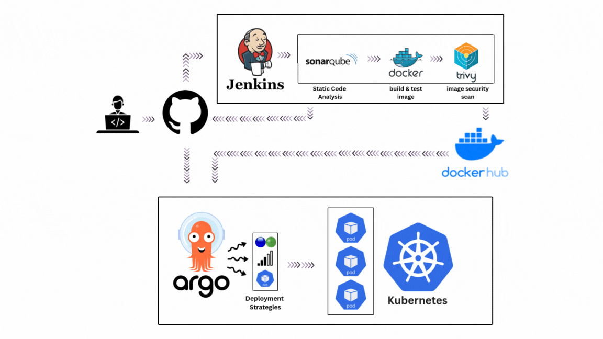

# DevSecOps CI/CD Pipeline with Advanced Kubernetes Deployments

A comprehensive DevSecOps pipeline demonstrating **Jenkins**, **SonarQube**, **Trivy**, **Kubernetes**, and **GitOps** with three deployment strategies: **Rolling**, **Blue-Green**, and **Canary** deployments.

## 🏗️ Architecture

```
Developer → Git Push → Jenkins CI/CD → Static Code Analysis → Docker Build → Image Security Scan → GitOps → Argo CD → Kubernetes
```



**Pipeline Flow:**
1. **Code Push** triggers Jenkins pipeline
2. **SonarQube** performs static code analysis
3. **Image build** in isolated DinD environment for secure builds.
4. **Trivy scans** for container image vulnerabilities
5. **Automated tests** execution
6. **GitOps** updates Kubernetes manifests
7. **Argo CD** deploys to Kubernetes cluster

## 🚀 Key Technologies

**CI/CD & Security:**
- **Jenkins** - Pipeline orchestration with Docker-in-Docker
- **SonarQube** - Static Application Security Testing (SAST)
- **Trivy** - Container vulnerability and secret scanning

**Deployment & GitOps:**
- **Kubernetes** - Container orchestration
- **Argo CD** - GitOps continuous deployment
- **Argo Rollouts** - Advanced deployment strategies

## 📋 Deployment Strategies

### 1. **Standard Rolling Updates** (`manifests/Deployment/`)
Traditional Kubernetes deployments with sequential pod replacement

### 2. **Blue-Green Deployment** (`manifests/Rollout-BlueGreen/`)
Zero-downtime deployments with instant traffic switching and rollback

### 3. **Canary Deployment** (`manifests/Rollout-Canary/`)
Progressive traffic shifting: 25% → 50% → 75% → 100% with automated progression

## 🛠️ Quick Start

### 1. Infrastructure Setup
```bash
# Create Docker volumes
docker volume create jenkins_home dind_data sonarqube_data sonarqube_extensions sonarqube_logs postgresql_data

# Launch services
docker-compose up -d

# Get Jenkins password
docker exec jenkins cat /var/jenkins_home/secrets/initialAdminPassword
```

**Services:**
- Jenkins: http://localhost:8080
- SonarQube: http://localhost:9000 (admin/admin)

### 2. Kubernetes Setup 
> **📝 Important Note**: The Kubernetes Ingress configurations in this project are designed for **KinD (Kubernetes in Docker)** for local development. For production Kubernetes environments, you'll need to configure your **Ingress Controller** or **Load Balancer** accordingly. Adjust the ingress rules and service types based on your cluster setup.

- to use KinD for local development, check KinD_setup_guide.md


### 3. Jenkins Configuration

**Required Credentials:**
- `dockerhub-credentials` - Docker Hub authentication
- `github-id` - SSH private key for Git operations

**Required Plugins:**
- Docker Pipeline, SonarQube Scanner, SSH Agent, Kubernetes CLI

## ⚙️ Pipeline Configuration

### Select Deployment Strategy
Edit `Jenkinsfile` environment:
```groovy
environment {
    DEPLOYMENT_STRATEGY = "BlueGreen"  // Options: Standard, Canary, BlueGreen
}
```

### Security Integration
- **SonarQube** analyzes code quality and security vulnerabilities
- **Trivy** scans containers and filesystem for vulnerabilities/secrets
- **Reports** archived as Jenkins artifacts

## 🎛️ Managing Deployments

### Blue-Green Operations
```bash
# Monitor deployment
kubectl argo rollouts get rollout flask-app-bluegreen -n flask-app --watch

# Promote to production
kubectl argo rollouts promote flask-app-bluegreen -n flask-app

# Rollback
kubectl argo rollouts undo flask-app-bluegreen -n flask-app
```

### Canary Operations
```bash
# Watch progressive deployment
kubectl argo rollouts get rollout flask-app-rollout -n flask-app --watch

# Manual promotion
kubectl argo rollouts promote flask-app-rollout -n flask-app

# Abort canary
kubectl argo rollouts abort flask-app-rollout -n flask-app
```

## 📁 Project Structure

```
├── docker-compose.yaml         # Jenkins + DinD + SonarQube + PostgreSQL
├── Jenkinsfile                 # DevSecOps pipeline
├── sonar-project.properties    # SonarQube configuration
├── app/                        # Sample Flask application
│   ├── Dockerfile
│   ├── app.py
│   └── tests/
└── manifests/                  # Kubernetes deployments
    ├── Deployment/             # Standard rolling updates
    ├── Rollout-BlueGreen/      # Blue-Green deployment
    └── Rollout-Canary/         # Canary deployment
```

## 🔐 Security Features

- **Docker-in-Docker** isolation for secure builds
- **SAST** with SonarQube for code vulnerabilities
- **Container scanning** with Trivy for CVEs and secrets
- **GitOps** approach with audit trail
- **Non-root containers** with resource limits

## 🏆 Key Highlights

- **DevSecOps Integration** - Security scanning in every build
- **Multiple Deployment Patterns** - Risk-appropriate deployment strategies  
- **GitOps Workflow** - Infrastructure as Code with automated updates
- **Zero-Downtime Deployments** - Blue-Green and Canary patterns

---

**Tech Stack:** Jenkins • Docker • Kubernetes • Argo CD • Argo Rollouts • SonarQube • Trivy • GitOps
